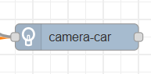
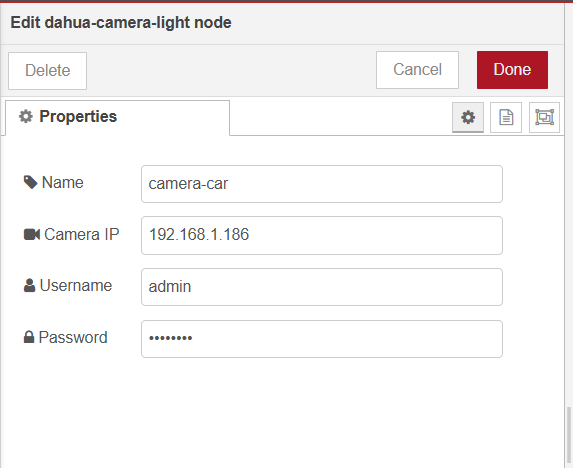
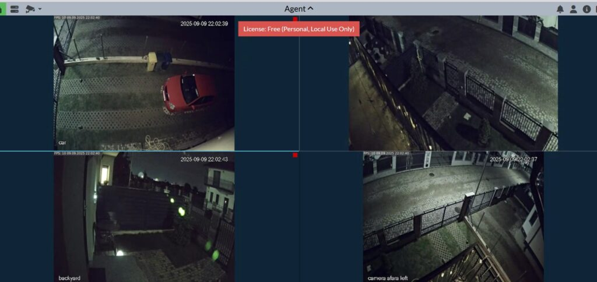

# node-red-contrib-dahua-camera-light

Node-RED node to control Dahua DH-F4C-LED camera light via RPC2 protocol.



## Features

- Control Dahua camera LED light brightness
- Support for Manual, Auto, and Off modes
- **Multi-profile support** - applies settings to all camera profiles (General, Day, Night)
- Session caching for better performance
- Automatic retry on session timeout

## Installation

```bash
npm install node-red-contrib-dahua-camera-light
```

Or via Node-RED:
1. Open Node-RED
2. Go to menu → Manage palette
3. Install tab
4. Search for `node-red-contrib-dahua-camera-light`
5. Click Install

## Usage

### Configuration



- **Camera IP**: Dahua camera IP address
- **Username**: Username for camera access
- **Password**: Password for camera access

### Input Commands (msg.payload)

#### Numeric values:
- Any number `1-100` - Manual mode with specified brightness
- Example: `50` sets manual mode at 50% brightness

#### String commands:
- `"on"` - Manual mode at 100% brightness
- `"off"` - Turn light off
- `"auto"` - Auto mode at 100% brightness
- `"auto 75"` - Auto mode with specified brightness

### Examples

```javascript
// Manual mode at 25% brightness
msg.payload = 25;

// Manual mode at 100% brightness
msg.payload = "on";

// Turn light off
msg.payload = "off";

// Auto mode at 100% brightness
msg.payload = "auto";

// Auto mode at 60% brightness
msg.payload = "auto 60";
```

## Camera View



## Compatibility

- Node-RED version 1.0+
- Node.js version 12+
- Dahua cameras with RPC2 support (tested on DH-F4C-LED)

## Recent Updates

### v1.1.0
- **Fixed multi-profile support**: Now applies light settings to all camera profiles (General, Day, Night) instead of just Day profile
- Improved reliability and session management

## Support

If this node helped you, consider buying me a coffee! ☕

[](https://buymeacoffee.com/ecologic)

## License

MIT


## Publish

cp /data/.npmrc /usr/src/node-red/.npmrc
npm publish

